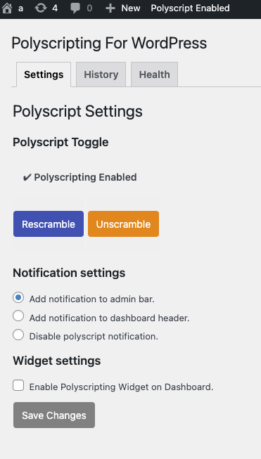
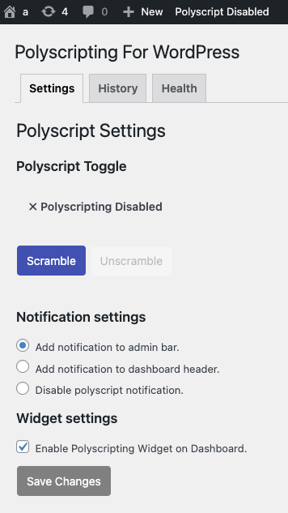
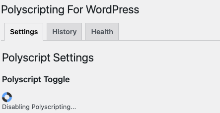

# DEPRECATION NOTICE

Please note that this repository has been deprecated and is no longer actively maintained by Polyverse Corporation.  It may be removed in the future, but for now remains public for the benefit of any users.

Importantly, as the repository has not been maintained, it may contain unpatched security issues and other critical issues.  Use at your own risk.

While it is not maintained, we would graciously consider any pull requests in accordance with our Individual Contributor License Agreement.  https://github.com/polyverse/contributor-license-agreement

For any other issues, please feel free to contact info@polyverse.com

---

# Polyscripting

The Polyscripting plugin provides an ease of use access panel when it comes to scrambling, rescrambling, and unscrambling your WordPress site.

### Description
The Polyscripting plugin requires users to atleast have a Polyscript-able Wordpress image for compatablity.
Refer to repo for setup FAQ and building a Polyscriptable WordPress Image: 

https://github.com/polyverse/polyscripted-wordpress

Once the polyscripting site is setup, this plugin allows users to scramble, rescramble, and unscramble the wordpress site via WordPress UI.

This plugin also allows a live view of the current state of the site: polyscripting disabled or enabled to allow transparency to the current site status.

It also allows access to the site's polyscripting history and health updates on the containers serving the wordpress site.

 

### Further Reading

To make use of this plugin see : https://github.com/polyverse/polyscripted-wordpress

For more information about Polyscripting please refer to:  https://polyverse.com/products/php-security-polyscripting/ 

All relevant Polyscripting information for PHP including demos, install guides, and white papers can be found at Polyverse.com

To see a live example of WordPress utilizing polyscripting see: polyscripted.com and unpolyscripted.com

### Notes

This plugin requires configuration on the server serving the WordPress site.

There is a minute or two delay while the site is changing state, tho your website will continue to be served, no updates should be made to the wordpress site during this time.

Contributors: thetruestblue, chasehaluptzok

License: GPLv3

License URI: https://www.gnu.org/licenses/gpl-3.0.html
